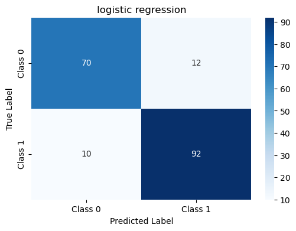

# Performance Analysis of Classification Models

## Heart Failure Classification Problem

## Contents

1. [Introduction and Dataset Specification](#introduction-and-dataset-specification)
2. [Dataset and Preprocessing](#dataset-and-preprocessing)
3. [Models and Hyperparameter Tuning](#models-and-hyperparameter-tuning)
4. [Results and Performance Comparison](#results-and-performance-comparison)
   - [Accuracy and F1-Score](#accuracy-and-f1-score)
   - [Confusion Matrices](#confusion-matrices)
5. [Analysis and Insights](#analysis-and-insights)
   - [Best Performing Model: Decision Tree](#best-performing-model-decision-tree)
   - [Bagging vs. Decision Tree](#bagging-vs-decision-tree)
   - [AdaBoost vs. Other Models](#adaboost-vs-other-models)
6. [Confusion Matrices and Insights](#confusion-matrices-and-insights)
   - [Decision Tree Classifier](#decision-tree-classifier)
   - [Bagging Classifier](#bagging-classifier)
   - [AdaBoost Classifier](#adaboost-classifier)
7. [Key Misclassification Patterns](#key-misclassification-patterns)
8. [Final Comparison](#final-comparison)
9. [Conclusion](#conclusion)
10. [Bonus](#bonus)
    - [Accuracy and F1-Score](#accuracy-and-f1-score)
    - [Confusion Matrices](#confusion-matrices)
    - [Tuning](#tuning)

---

## Introduction and Dataset Specification

This dataset contains medical records for heart disease prediction, with **918 samples** and **12 features**. The features include:

- **Continuous variables:** Age, RestingBP, Cholesterol, MaxHR.
- **Categorical variables:** Sex, ChestPainType, ExerciseAngina.
- **Target Variable:** `HeartDisease` (1 indicates presence, 0 indicates absence).

The dataset provides valuable cardiovascular health indicators, useful for predictive modeling.

---

## Dataset and Preprocessing

### Key preprocessing steps:

- **Encoding categorical variables:**
  - `Sex`: M → 1, F → 0
  - `ExerciseAngina`: Y → 1, N → 0
  - One-Hot Encoding (OHE) for categorical features.

- **Data Splitting:**
  - Training Set (70%)
  - Validation Set (10%)
  - Test Set (20%)

---

## Models and Hyperparameter Tuning

### **Decision Tree**
- **Tuned Parameters:**
  - `max_depth`: 5 - 50
  - `min_samples_split`: 2 - 100

### **Bagging Classifier**
- **Tuned Parameter:**
  - `n_estimators`: 20 - 50 (steps of 5)

### **AdaBoost Classifier**
- **Tuned Parameter:**
  - `n_weak_learners`: 20, 50, 100

Hyperparameter tuning was performed using validation data.

---

## Results and Performance Comparison

### Accuracy and F1-Score

  <table>
    <tr>
      <th>Model</th>
      <th>Accuracy</th>
      <th>F1-Score</th>
    </tr>
    <tr>
      <td>Decision Tree</td>
      <td>0.842</td>
      <td>0.854</td>
    </tr>
    <tr>
      <td>Bagging Classifier</td>
      <td>0.815</td>
      <td>0.830</td>
    </tr>
    <tr>
      <td>AdaBoost Ensemble</td>
      <td>0.783</td>
      <td>0.800</td>
    </tr>
  </table>

### Confusion Matrices

  
  
  

---

## Conclusion

- **Decision Tree**: Best performer.
- **Bagging**: No significant accuracy improvement.
- **AdaBoost**: Least effective, struggles with misclassifications.

---

## Bonus

### Accuracy and F1-Score

  <table>
    <tr>
      <th>Model</th>
      <th>Accuracy</th>
      <th>F1-Score</th>
    </tr>
    <tr>
      <td>KNN</td>
      <td>0.853</td>
      <td>0.867</td>
    </tr>
    <tr>
      <td>Logistic Regression</td>
      <td>0.880</td>
      <td>0.893</td>
    </tr>
    <tr>
      <td>Neural Network</td>
      <td>0.869</td>
      <td>0.884</td>
    </tr>
  </table>

### Confusion Matrices

  
    
  

### Tuning

  
    

---

_Assignment 1 Report - Pattern Recognition, March 2025_
